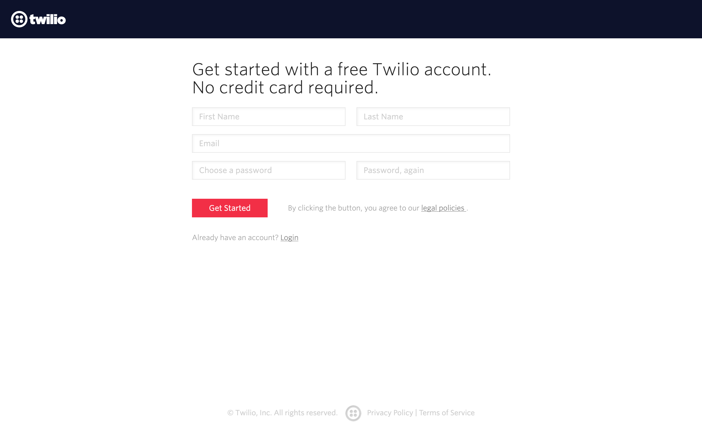
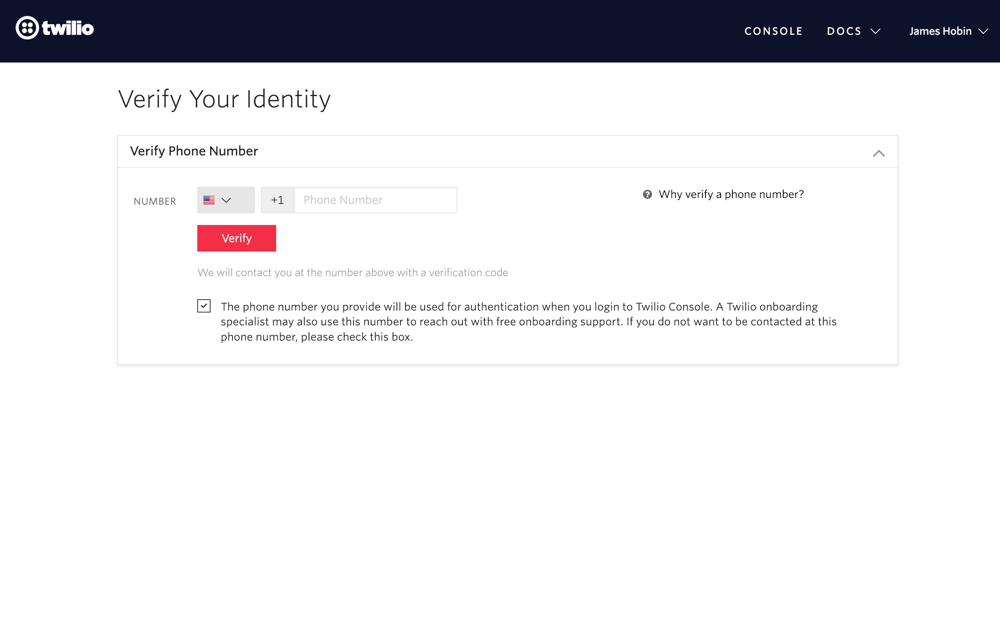
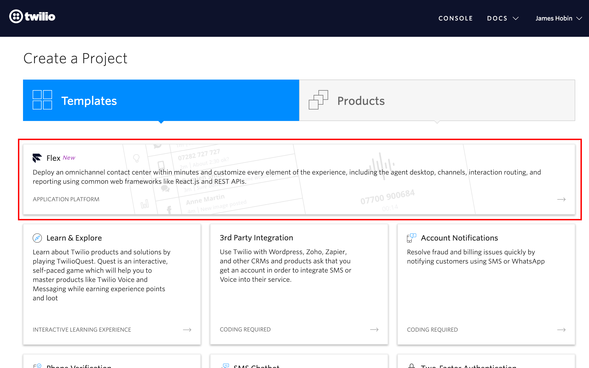
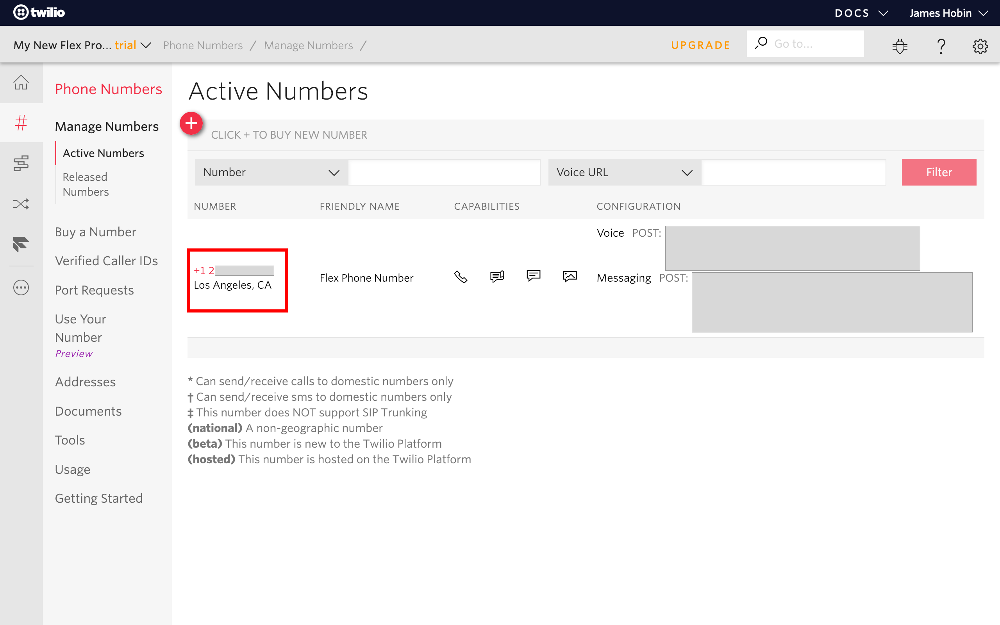
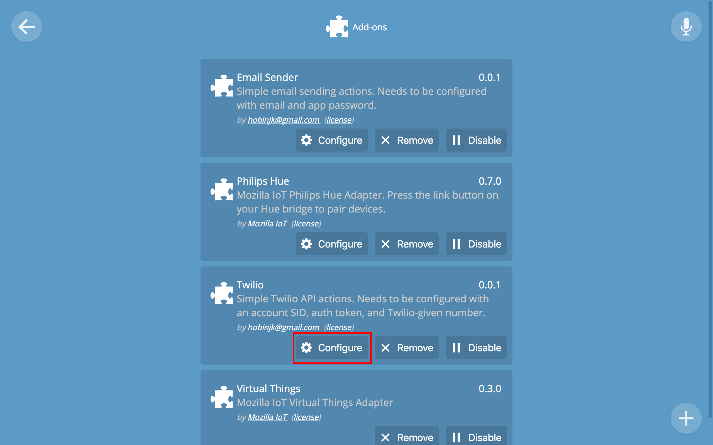
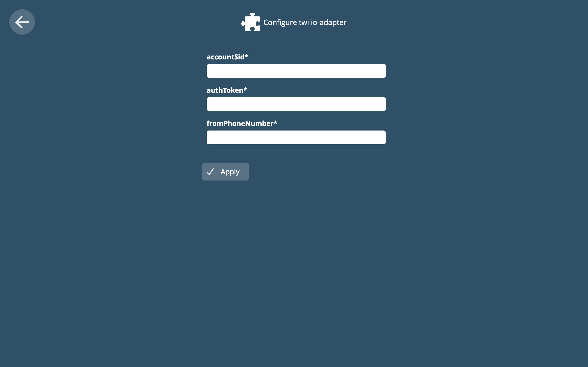
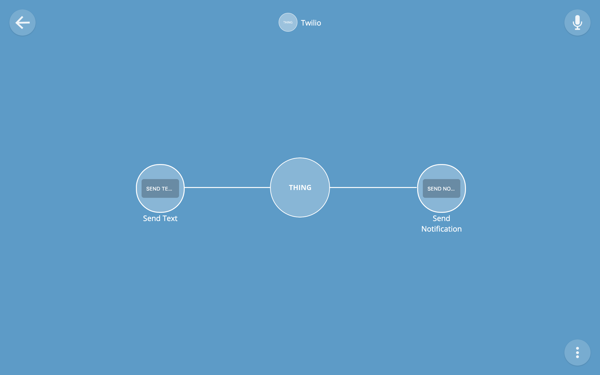
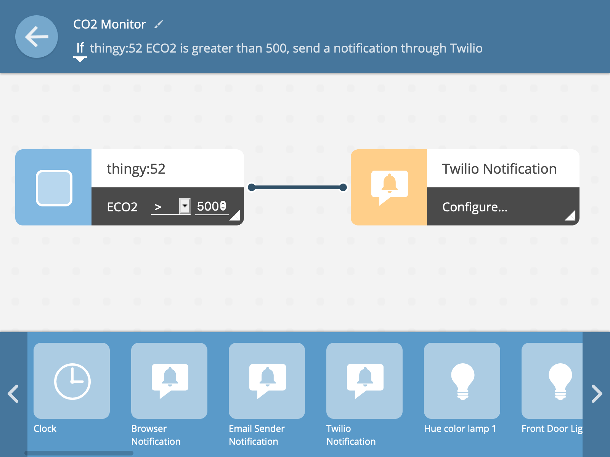
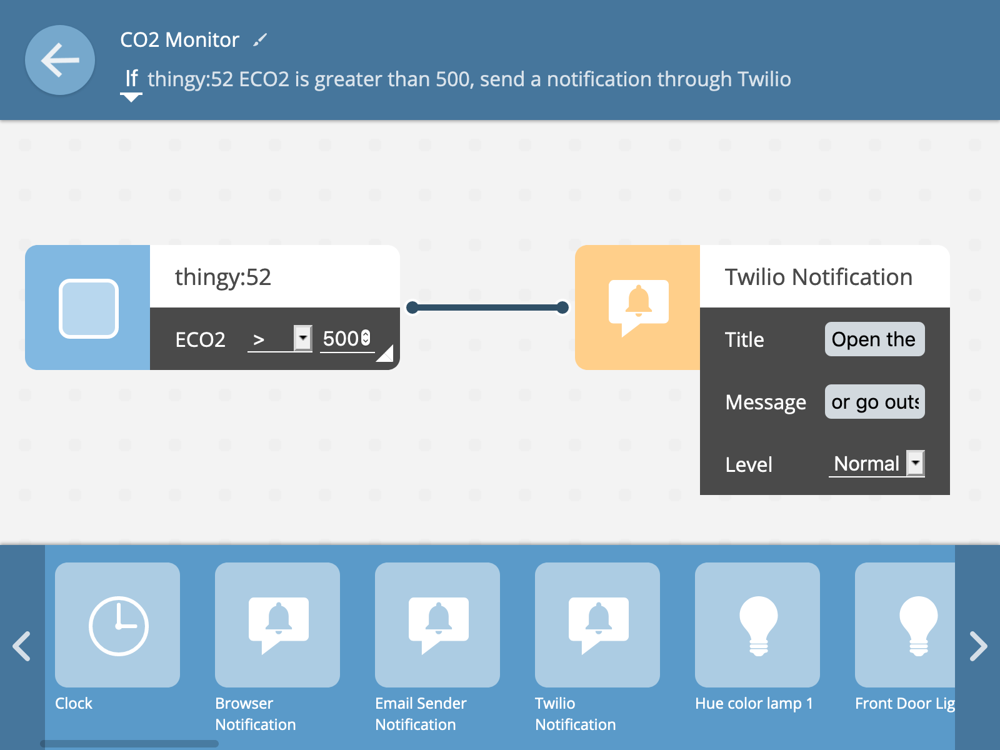

twilio-adapter
==============
A simple adapter exposing actions to send texts through the Mozilla IoT
Gateway. Requires a Twilio API account.

Setup
-----
On Twilio's homepage click sign up

Fill out your account details.

Verify a phone number with Twilio. This should be the number you're planning to
send text messages to using the adapter.

Click on the Flex project to create a simple base to get an account SID and
auth token. Because we're just using this project for API access, it's name and
specific details don't matter too much.

With the Flex project created we now want to get to the Twilio Console to get
our API access information. I found the easiest way to get to this is to
navigate to [https://twilio.com/console](https://twilio.com/console). Take note
of the account SID and auth token for configuring the adapter later.

We also need to know what phone number Twilio plans to use for us. If we scroll
down on this console page, we can navigate to the Phone Numbers section. Like
the account SID and auth token, copy down this phone number for later.

Next, we install the Twilio adapter from the addon list. On your gateway, go to
the Settings section and click on Addons. Next, click the plus (+) button and
scroll down to install the Twilio adapter.
With the adapter installed, we can click "Configure" to configure the adapter
with our account SID, auth token, and assigned phone number from the Twilio
console.

With the adapter installed we can now navigate to the main Things page and
click the plus button to add the Twilio thing.

Finally, we navigate to the Rules section of the Gateway to use
Twilio notifications in a rule. We drag and drop the Twilio Notification block
to the Effect (right) side of the rule and click "Configure" to setup a basic
message.

